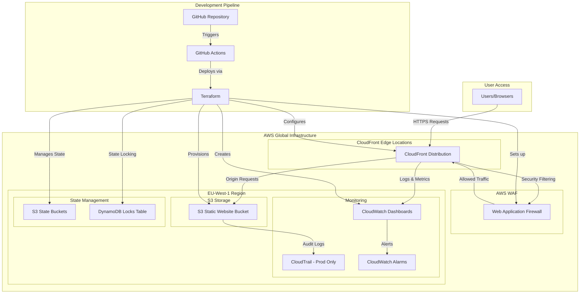
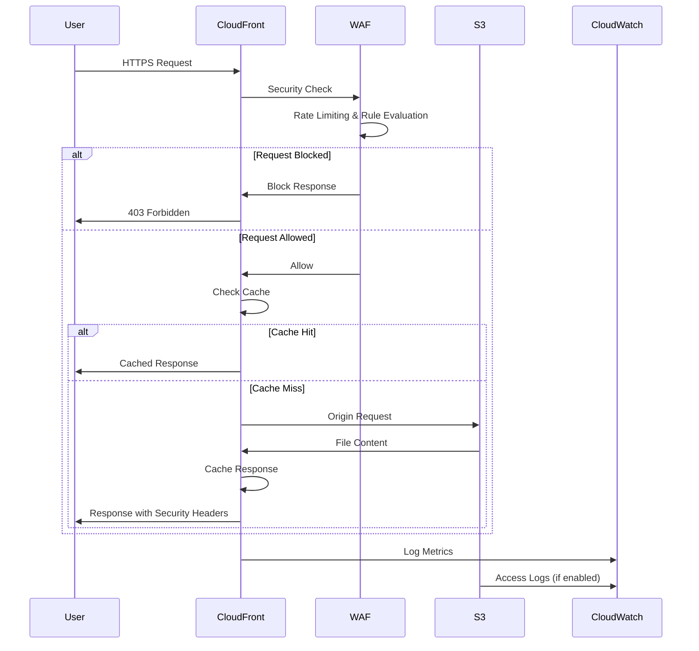
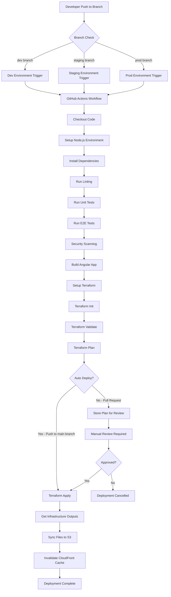

# CineVerse Frontend Infrastructure

## Table of Contents

- [Overview](#overview)
- [Architecture](#architecture)
- [Infrastructure Components](#infrastructure-components)
- [Environment Configuration](#environment-configuration)
- [Prerequisites](#prerequisites)
- [Getting Started](#getting-started)
- [Deployment Process](#deployment-process)
- [CI/CD Pipeline](#cicd-pipeline)
- [Security](#security)
- [Monitoring and Logging](#monitoring-and-logging)
- [Cost Optimization](#cost-optimization)
- [Operations](#operations)
- [Troubleshooting](#troubleshooting)


## Overview

CineVerse is a full-stack entertainment web application built with Angular for the frontend. This repository contains the Infrastructure as Code (IaC) for deploying the Angular frontend to AWS using Terraform. The infrastructure provides a secure, scalable, and cost-optimized deployment solution with comprehensive monitoring and automated CI/CD capabilities.

### Key Features

- **Multi-environment support**: Development, staging, and production environments
- **Global content delivery**: CloudFront CDN for optimal performance
- **Security-first approach**: WAF protection, encrypted storage, and security headers
- **Cost optimization**: Environment-specific configurations and intelligent resource allocation
- **Automated deployments**: GitHub Actions CI/CD pipeline
- **Comprehensive monitoring**: CloudWatch dashboards and automated alerting
- **Infrastructure as Code**: Fully automated infrastructure provisioning with Terraform

## Architecture

### High-Level Architecture



### Request Flow Architecture



### Deployment Flow



## Infrastructure Components

### Core Components

| Component | Purpose | Environment Scope |
|-----------|---------|-------------------|
| **S3 Bucket** | Static website hosting | Per environment |
| **CloudFront Distribution** | Global CDN and edge caching | Per environment |
| **WAF Web ACL** | Security protection and filtering | Staging & Production |
| **CloudWatch Dashboard** | Performance monitoring | All environments |
| **CloudWatch Alarms** | Automated alerting | All environments |
| **CloudTrail** | Audit logging | Production only |
| **S3 State Buckets** | Terraform state storage | Per environment |
| **DynamoDB Table** | Terraform state locking | Shared across environments |

### Module Structure

```
terraform/
├── modules/
│   ├── s3-website/          # S3 static hosting configuration
│   │   ├── main.tf          # S3 bucket, encryption, policies
│   │   ├── variables.tf     # Module input variables
│   │   └── outputs.tf       # Module outputs
│   ├── cloudfront/          # CloudFront CDN configuration
│   │   ├── main.tf          # Distribution, cache behaviors, security
│   │   ├── variables.tf     # Module input variables
│   │   └── outputs.tf       # Module outputs
│   ├── waf/                 # Web Application Firewall
│   │   ├── main.tf          # WAF rules, rate limiting, logging
│   │   ├── variables.tf     # Module input variables
│   │   └── outputs.tf       # Module outputs
│   └── monitoring/          # CloudWatch monitoring
│       ├── main.tf          # Dashboards, alarms, CloudTrail
│       ├── variables.tf     # Module input variables
│       └── outputs.tf       # Module outputs
├── environments/            # Environment-specific configurations
├── bootstrap/              # Initial state backend setup
├── main.tf                 # Root module configuration
├── variables.tf            # Global variables
├── outputs.tf              # Infrastructure outputs
├── locals.tf               # Local values and computed configurations
└── backend.tf              # Backend configuration template
```

## Environment Configuration

### Environment Matrix

| Configuration | Development | Staging | Production |
|---------------|-------------|---------|------------|
| **AWS Region** | eu-west-1 | eu-west-1 | eu-west-1 |
| **WAF Protection** | Disabled | Enabled | Enabled |
| **S3 Versioning** | Disabled | Enabled | Enabled |
| **CloudFront Price Class** | PriceClass_100 | PriceClass_200 | PriceClass_All |
| **Monitoring Period** | 5 minutes | 5 minutes | 1 minute |
| **CloudTrail Logging** | Disabled | Disabled | Enabled |
| **Rate Limiting** | 10,000 req/5min | 5,000 req/5min | 2,000 req/5min |
| **Custom Domain** | None | staging.domain.com | domain.com |

### Resource Naming Convention

```
Format: {project}-{component}-{environment}-{random}
Examples:
- cineverse-frontend-prod-a1b2c3d4 (S3 bucket)
- cineverse-prod-waf (WAF Web ACL)
- cineverse-prod-frontend (CloudWatch dashboard)
```

## Prerequisites

### Required Tools

- **AWS CLI** (v2.0+): Configured with appropriate credentials
- **Terraform** (v1.0+): Infrastructure provisioning
- **Node.js** (v18+): Frontend application building
- **npm** (v8+): Package management
- **Git**: Version control

### AWS Permissions

The deployment requires an AWS user or role with the following managed policies:

- `AmazonS3FullAccess`
- `CloudFrontFullAccess`
- `AWSWAFv2FullAccess`
- `CloudWatchFullAccess`
- `CloudTrailFullAccess`
- `DynamoDBFullAccess`
- `IAMReadOnlyAccess`

### Environment Variables

Set the following environment variables in your CI/CD system:

```bash
AWS_ACCESS_KEY_ID=your_access_key
AWS_SECRET_ACCESS_KEY=your_secret_key
AWS_DEFAULT_REGION=eu-west-1
SNYK_TOKEN=your_snyk_token (optional, for security scanning)
```

## Getting Started

### Initial Setup

1. **Clone the repository**:
   ```bash
   git clone <repository-url>
   cd cineverse
   ```

2. **Bootstrap the Terraform backend** (one-time setup):
   ```bash
   make bootstrap
   ```

3. **Configure environment variables**:
   ```bash
   export AWS_PROFILE=your-aws-profile
   export AWS_REGION=eu-west-1
   ```

### First Deployment

1. **Deploy to development environment**:
   ```bash
   make deploy ENV=dev
   ```

2. **Verify deployment**:
   ```bash
   # Check infrastructure outputs
   cd terraform
   terraform output -json
   
   # Test the application
   curl -I https://$(terraform output -raw cloudfront_domain_name)
   ```

### Environment Promotion

```bash
# Deploy to staging
make deploy ENV=staging

# Deploy to production
make deploy ENV=prod
```

## Deployment Process

### Manual Deployment

The deployment process consists of several phases:

1. **Build Phase**:
   ```bash
   cd frontend
   npm ci
   npm run build:prod  # or build:staging, build:dev
   ```

2. **Infrastructure Phase**:
   ```bash
   cd terraform
   terraform init -backend-config="environments/prod/backend.hcl"
   terraform plan -var-file="environments/prod/terraform.tfvars"
   terraform apply -auto-approve
   ```

3. **Content Deployment**:
   ```bash
   # Deploy static assets with long cache
   aws s3 sync frontend/dist/ s3://$S3_BUCKET/ \
     --cache-control "public, max-age=31536000" \
     --exclude "*.html" --exclude "*.js" --exclude "*.css"
   
   # Deploy dynamic assets with short cache
   aws s3 sync frontend/dist/ s3://$S3_BUCKET/ \
     --cache-control "public, max-age=0, must-revalidate" \
     --include "*.html" --include "*.js" --include "*.css"
   ```

4. **Cache Invalidation**:
   ```bash
   aws cloudfront create-invalidation \
     --distribution-id $CLOUDFRONT_ID \
     --paths "/*"
   ```

### Automated Deployment

The GitHub Actions workflow automatically handles deployments when code is pushed to specific branches:

- **dev branch** → Development environment
- **staging branch** → Staging environment
- **prod branch** → Production environment

## CI/CD Pipeline

### Workflow Overview

The CI/CD pipeline implements a comprehensive deployment strategy with the following stages:

#### 1. Code Quality & Testing
- **Linting**: ESLint and Angular style checks
- **Unit Testing**: Jest-based unit tests with coverage reports
- **E2E Testing**: Cypress end-to-end testing
- **Security Scanning**: Snyk vulnerability assessment and npm audit

#### 2. Build & Artifact Creation
- **Multi-environment builds**: Environment-specific Angular builds
- **Artifact storage**: Temporary storage of build outputs
- **Build optimization**: Production builds with tree-shaking and minification

#### 3. Infrastructure Planning
- **Terraform validation**: Syntax and configuration validation
- **Infrastructure planning**: Change analysis and impact assessment
- **Security review**: Infrastructure security compliance checks

#### 4. Deployment Execution
- **Infrastructure provisioning**: Terraform apply with environment-specific variables
- **Content deployment**: Optimized S3 sync with appropriate cache headers
- **CDN invalidation**: CloudFront cache invalidation for immediate updates

### Pipeline Configuration

The pipeline is configured with environment-specific deployment gates:

```yaml
# Environment Protection Rules
Development:
  - Auto-deploy on dev branch push
  - No manual approval required
  - Parallel deployments allowed

Staging:
  - Auto-deploy on staging branch push
  - Optional manual approval
  - Sequential deployments

Production:
  - Auto-deploy on prod branch push
  - Mandatory manual approval (configurable)
  - Sequential deployments only
  - Additional security validations
```

## Security

### Security Architecture

The infrastructure implements multiple layers of security:

#### 1. Network Security
- **HTTPS Enforcement**: All traffic redirected to HTTPS
- **Security Headers**: Comprehensive security header implementation
- **Content Security Policy**: Restrictive CSP headers to prevent XSS

#### 2. Access Control
- **Origin Access Control**: S3 buckets accessible only via CloudFront
- **IAM Policies**: Least-privilege access principles
- **Private Buckets**: No direct public access to S3 resources

#### 3. Application Security
- **WAF Protection**: AWS managed rules and custom rate limiting
- **DDoS Protection**: CloudFront and AWS Shield integration
- **Input Validation**: Frontend and backend validation layers

### Security Headers Configuration

```javascript
// Implemented via CloudFront Response Headers Policy
{
  "Strict-Transport-Security": "max-age=31536000; includeSubDomains",
  "X-Content-Type-Options": "nosniff",
  "X-Frame-Options": "DENY",
  "Referrer-Policy": "strict-origin-when-cross-origin",
  "Content-Security-Policy": "default-src 'self'; script-src 'self' 'unsafe-inline' 'unsafe-eval'; style-src 'self' 'unsafe-inline'; img-src 'self' data: https:; font-src 'self' data:; connect-src 'self' api.domain.com; media-src 'self';"
}
```

### WAF Rule Configuration

The WAF implementation includes:

- **AWS Core Rule Set**: Protection against OWASP Top 10
- **Known Bad Inputs**: Detection of malicious patterns
- **Rate Limiting**: Configurable request rate limits per IP
- **Geo-blocking**: Optional country-based access restrictions
- **Custom Rules**: Application-specific security rules

## Monitoring and Logging

### CloudWatch Dashboards

Each environment includes a comprehensive dashboard monitoring:

#### Frontend Performance Metrics
- Request count and rate
- Data transfer (bytes downloaded/uploaded)
- Cache hit ratio
- Origin request latency

#### Error Monitoring
- 4xx error rate and count
- 5xx error rate and count
- Custom error responses
- WAF blocked requests

#### Security Metrics
- WAF rule matches
- Blocked IP addresses
- Rate limit violations
- Geographic request distribution

### Automated Alerting

CloudWatch alarms are configured for:

| Metric | Threshold | Action |
|--------|-----------|--------|
| **4xx Error Rate** | >5% for 10 minutes | SNS notification |
| **5xx Error Rate** | >1% for 5 minutes | SNS notification |
| **High Request Rate** | >10,000 RPM | Auto-scaling consideration |
| **Cache Hit Rate** | <85% for 15 minutes | Performance investigation |

### Audit Logging

Production environments include CloudTrail configuration for:

- **API Calls**: All AWS API interactions
- **Resource Changes**: Infrastructure modifications
- **Access Patterns**: S3 object access (when enabled)
- **Security Events**: Authentication and authorization events

## Cost Optimization

### Environment-Specific Optimizations

#### Development Environment
- **CloudFront Price Class**: PriceClass_100 (North America and Europe)
- **WAF**: Disabled to reduce costs
- **Monitoring**: Reduced frequency monitoring
- **Storage**: No versioning enabled

#### Staging Environment
- **CloudFront Price Class**: PriceClass_200 (North America, Europe, Asia)
- **WAF**: Enabled with standard rules
- **Monitoring**: Standard monitoring frequency
- **Storage**: Versioning enabled with shorter retention

#### Production Environment
- **CloudFront Price Class**: PriceClass_All (Global distribution)
- **WAF**: Full protection enabled
- **Monitoring**: High-frequency monitoring
- **Storage**: Full versioning with intelligent tiering

### Cost Control Measures

1. **S3 Lifecycle Policies**:
   ```hcl
   lifecycle_rule {
     enabled = true
     noncurrent_version_expiration {
       days = var.environment == "prod" ? 30 : 7
     }
   }
   ```

2. **Intelligent Tiering** (Production only):
   ```hcl
   resource "aws_s3_bucket_intelligent_tiering_configuration" "website" {
     count  = var.environment == "prod" ? 1 : 0
     bucket = aws_s3_bucket.website.id
     status = "Enabled"
   }
   ```

3. **CloudWatch Log Retention**:
   ```hcl
   retention_in_days = var.environment == "prod" ? 90 : 30
   ```

## Operations

### Available Commands

The project includes a comprehensive Makefile for common operations:

```bash
# Infrastructure Management
make bootstrap          # One-time backend setup
make init ENV=dev      # Initialize Terraform for environment
make plan ENV=staging  # Plan infrastructure changes
make apply ENV=prod    # Apply infrastructure changes
make destroy ENV=dev   # Destroy environment (use with caution)

# Application Deployment
make deploy ENV=dev         # Full deployment (recommended)
make deploy-plan ENV=prod   # Plan-only deployment
make build ENV=staging      # Build frontend only
make test                   # Run frontend tests
make lint                   # Run code linting

# Maintenance
make clean             # Clean build artifacts and temporary files
```

### Manual Operations

#### View Infrastructure Status
```bash
cd terraform
terraform show
terraform state list
terraform output -json
```

#### CloudFront Operations
```bash
# List distributions
aws cloudfront list-distributions

# Get distribution details
aws cloudfront get-distribution --id E1234567890ABC

# Create invalidation
aws cloudfront create-invalidation \
  --distribution-id E1234567890ABC \
  --paths "/*"
```

#### S3 Operations
```bash
# List bucket contents
aws s3 ls s3://bucket-name --recursive

# Sync local files to S3
aws s3 sync ./dist/ s3://bucket-name/ --delete

# Check bucket policy
aws s3api get-bucket-policy --bucket bucket-name
```

### Backup and Recovery

#### State File Backup
- Terraform state files are automatically versioned in S3
- DynamoDB provides state locking to prevent corruption
- Manual state backup: `terraform state pull > backup.tfstate`

#### Application Recovery
1. **Infrastructure Recovery**: Re-run Terraform apply
2. **Content Recovery**: Re-deploy from Git using CI/CD pipeline
3. **Emergency Rollback**: Use previous CloudFront distribution if available

## Troubleshooting

### Common Issues and Solutions

#### 1. Terraform State Lock Issues
**Problem**: "Error acquiring the state lock"

**Solution**:
```bash
# Check for existing locks
aws dynamodb scan --table-name cineverse-terraform-locks

# Force unlock (use with caution)
terraform force-unlock LOCK_ID
```

#### 2. S3 Bucket Name Conflicts
**Problem**: "BucketAlreadyExists error"

**Solution**:
- Bucket names include random suffixes to prevent conflicts
- If persistent, manually change the random string resource
- Ensure bucket names are globally unique

#### 3. CloudFront Propagation Delays
**Problem**: Changes not visible immediately

**Expected Behavior**:
- CloudFront changes can take 15-20 minutes to propagate
- Use `aws cloudfront get-distribution` to check deployment status
- Consider using CloudFront invalidations for immediate updates

#### 4. WAF False Positives
**Problem**: Legitimate requests being blocked

**Investigation**:
```bash
# Check WAF logs
aws logs filter-log-events \
  --log-group-name /aws/wafv2/cineverse-prod \
  --start-time $(date -d '1 hour ago' +%s)000

# Review blocked requests
aws wafv2 get-sampled-requests \
  --web-acl-arn arn:aws:wafv2:... \
  --rule-metric-name RateLimitRuleMetric \
  --scope CLOUDFRONT \
  --time-window StartTime=$(date -d '1 hour ago' +%s),EndTime=$(date +%s) \
  --max-items 100
```

#### 5. Build Failures
**Problem**: Angular build fails in CI/CD

**Debug Steps**:
1. Check Node.js version compatibility
2. Verify npm dependencies are locked
3. Review build logs for specific errors
4. Test build locally with same Node.js version

#### 6. Performance Issues
**Problem**: Slow application loading

**Investigation Checklist**:
- Check CloudFront cache hit ratio
- Review S3 to CloudFront latency
- Verify compression is enabled
- Analyze CloudWatch metrics for bottlenecks

### Diagnostic Commands

```bash
# Infrastructure Health Check
make plan ENV=prod  # Should show "No changes"

# Application Health Check
curl -I https://$(cd terraform && terraform output -raw cloudfront_domain_name)

# Performance Testing
curl -w "@curl-format.txt" -o /dev/null -s \
  https://$(cd terraform && terraform output -raw cloudfront_domain_name)

# Security Testing
nmap -p 443 $(cd terraform && terraform output -raw cloudfront_domain_name)
```

### Log Analysis

#### CloudFront Access Logs
```bash
# Enable logging (if not already enabled)
aws cloudfront put-distribution-config --id E1234567890ABC \
  --distribution-config file://distribution-config.json

# Analyze logs
aws s3 cp s3://cloudfront-logs-bucket/prefix/ . --recursive
```

#### WAF Logs Analysis
```bash
# Query recent blocked requests
aws logs filter-log-events \
  --log-group-name /aws/wafv2/cineverse-prod \
  --filter-pattern "{ $.action = \"BLOCK\" }" \
  --start-time $(date -d '24 hours ago' +%s)000
```

## Contributing

### Development Workflow

1. **Fork and Clone**: Fork the repository and clone locally
2. **Create Feature Branch**: `git checkout -b feature/description`
3. **Make Changes**: Implement changes following coding standards
4. **Test Locally**: Run tests and validate changes
5. **Submit Pull Request**: Create PR with detailed description

### Code Standards

- **Terraform**: Follow HashiCorp Configuration Language style guide
- **Angular**: Follow Angular style guide and ESLint rules
- **Documentation**: Update README.md for any infrastructure changes
- **Testing**: Include tests for new functionality

### Pull Request Process

1. **Pre-submission Checklist**:
   - [ ] All tests pass locally
   - [ ] Documentation updated
   - [ ] Terraform plan reviewed
   - [ ] Security implications considered

2. **Review Process**:
   - Code review by team members
   - Automated CI/CD validation
   - Infrastructure impact assessment
   - Security review for sensitive changes

3. **Merge Requirements**:
   - All CI checks pass
   - At least one approval from code owner
   - No conflicts with target branch
   - Documentation is up to date

